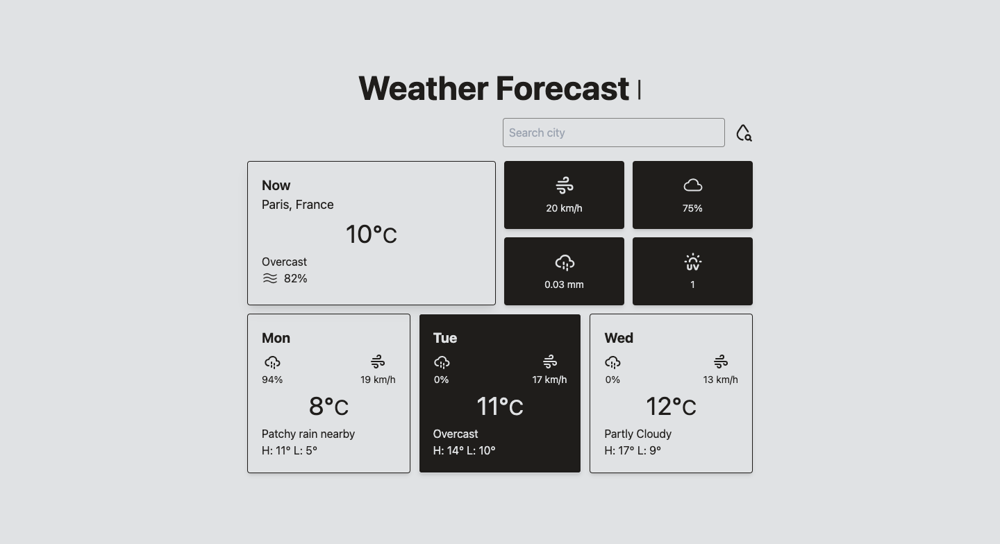

# Minimalist Weather Forecast ⛅️

Minimalist Weather Forecast App consuming [WeatherAPI](https://www.weatherapi.com) built with TypeScript and Tailwind

## Motivation

Who wants to see a complex and colorful UI for a Weather App right? A minimalist and captivating apperance is all you need for an unforgettable UX and straight to the point purpose.

## Description

This project relies more on native DOM manipulation over standard modern tooling. Nevertheless, concepts such as modules and separation of concerns play a role in maintainting the code organized and promote clean coding practices.

## Quick Start

### Live Demo

[Have a look!](https://alvarado08.github.io/weather-app/ "Minimalist Weather Forecast App")

## Usage
