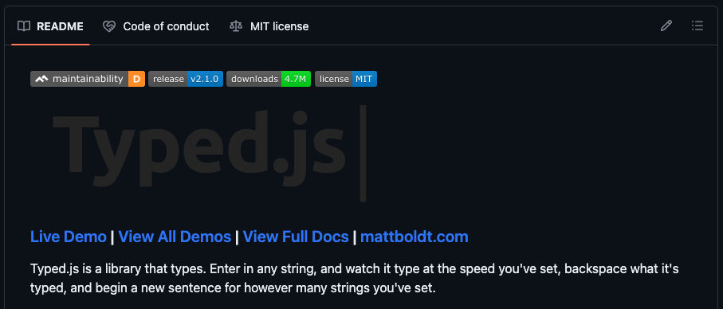

# Minimalist Weather Forecast ⛅️


Minimalist Weather Forecast App consuming [WeatherAPI](https://www.weatherapi.com) built with TypeScript and Tailwind

## Motivation

Who wants to see a complex and colorful UI for a Weather App right? A minimalist and captivating apperance is all you need for an unforgettable UX and straight to the point purpose.

## Description

This project relies more on native DOM manipulation over standard modern tooling. Nevertheless, concepts such as modules and separation of concerns play a role in maintainting the code organized and promote clean coding practices.

The project can be broken down in 3 main parts:

* API fetching
* DOM manipulation / Data rendering
* Event Listeners

### API Fetching

#### Endpoint Interface

Since we're working with Typescript, we can use an interface to structure the endpoint

We are also applying separation of concerns by exporting it to the main app.ts file

```typescript
export default interface WeatherInfo {
    location: {
        name: string,
        country: string
    },
    current: {
        temp_c: number,
        humidity: number,
        wind_kph: number,
        precip_mm: number,
        cloud: number,
        uv: number,
        condition: {
            text: string
        }
    },
    forecast: {
        forecastday: [
            {
                date: string,
                astro: {
                    sunrise: string,
                    sunset: string
                },
                day: {
                    date: string,
                    avgtemp_c: number,
                    maxtemp_c: number,
                    mintemp_c: number,
                    maxwind_kph: number,
                    daily_chance_of_rain: number,
                    condition: {
                        text: string
                    }
                }
            }
        ]
    }
}
```

#### getWeatherData() async function

```typescript
async function getWeatherData(): Promise<void> {
    try {
        let city = inputEl.value.trim();
        const url = `${baseUrl}/forecast.json?key=${key}&q=${city}&days=3`;
        const response = await fetch(url);
        const data = await response.json();
        // Successful response
        if(response.status === 200){
            showWeatherData(data);
            inputEl.value = '';
        }else{
            // Unsuccessful response
            clearContainer();
            inputEl.classList.add('border-red-500','text-red-500');
            inputEl.value = `${data.error.message}`;
            setTimeout(() => {
                inputEl.classList.remove('border-red-500','text-red-500');
                inputEl.value = '';
            }, 1500);
            console.log('Server Error',data.error.message);
        }
    } catch (error) {
        // Initial fetch request couldn't be completed
        clearContainer();
        inputEl.classList.add('border-red-500','text-red-500');
        inputEl.value = 'Oops...Technical difficulties!';
        setTimeout(() => {
            inputEl.classList.remove('border-red-500','text-red-500');
            inputEl.value = '';
        }, 1500);
        console.log('Fetch Error:',error);
    }
}
```

### DOM manipulation / Data rendering

The 3 **functions** in charge of updating and populating the DOM:

* **showWeatherData**: renders grid that displays weather information
* **loadingData**: renders loading skeleton
* **clearContainer**: resets the main container in case there's an error

#### showWeatherData

```typescript
function showWeatherData(data: WeatherInfo): void{
    mainContainer.classList.remove("w-full","flex","justify-center");
    mainContainer.classList.add('grid', 'grid-cols-2', 'gap-3');
    searchContainer.classList.remove('justify-center');
    searchContainer.classList.add('justify-end');
    mainContainer.innerHTML = `
        <article class="col-span-2 md:col-span-1 p-5 shadow-lg rounded backdrop-blur-lg border border-[#1F1D1B] w-full h-full text-[#1F1D1B] flex flex-col justify-between">
            <div>
                <h3 class="text-xl font-semibold">Now</h3>
                <h3 class="text-lg">${data.location.name}, ${data.location.country}</h3>
            </div>
            <h2 class="text-2xl md:text-4xl text-center inline">${Math.round(data.current.temp_c)}°<span class="text-2xl md:text-3xl">C</span></h2>
            <div class="gap-3">
                <h3>${data.current.condition.text}</h3>
                <div class="inline-flex items-center gap-2">
                    <svg xmlns="http://www.w3.org/2000/svg" class="icon icon-tabler icon-tabler-ripple" width="24" height="24" viewBox="0 0 24 24" stroke-width="1.5" stroke="currentColor" fill="none" stroke-linecap="round" stroke-linejoin="round"><path stroke="none" d="M0 0h24v24H0z" fill="none"/><path d="M3 7c3 -2 6 -2 9 0s6 2 9 0" /><path d="M3 17c3 -2 6 -2 9 0s6 2 9 0" /><path d="M3 12c3 -2 6 -2 9 0s6 2 9 0" />
                    </svg>
                    <span>${data.current.humidity}%</span>
                </div>
            </div>
        </article>
        <div class="col-span-2 md:col-span-1 gap-3">
            <div class="grid grid-cols-1 sm:grid-cols-2 gap-3 w-full h-full text-[#E0E2E4]">
                <article class="p-5 bg-[#1F1D1B] rounded shadow-md backdrop-blur-sm flex flex-col items-center justify-center gap-2">
                    <svg xmlns="http://www.w3.org/2000/svg" class="icon icon-tabler icon-tabler-wind" width="30" height="30" viewBox="0 0 24 24" stroke-width="2" stroke="currentColor" fill="none" stroke-linecap="round" stroke-linejoin="round"><path stroke="none" d="M0 0h24v24H0z" fill="none"/><path d="M5 8h8.5a2.5 2.5 0 1 0 -2.34 -3.24" /><path d="M3 12h15.5a2.5 2.5 0 1 1 -2.34 3.24" /><path d="M4 16h5.5a2.5 2.5 0 1 1 -2.34 3.24" />
                    </svg>
                    <span class="text-sm">${Math.round(data.current.wind_kph)} km/h</span>
                </article>
                <article class="p-5 bg-[#1F1D1B] rounded shadow-md backdrop-blur-sm flex flex-col items-center justify-center gap-2">
                    <svg xmlns="http://www.w3.org/2000/svg" class="icon icon-tabler icon-tabler-cloud" width="30" height="30" viewBox="0 0 24 24" stroke-width="1.5" stroke="currentColor" fill="none" stroke-linecap="round" stroke-linejoin="round"><path stroke="none" d="M0 0h24v24H0z" fill="none"/><path d="M6.657 18c-2.572 0 -4.657 -2.007 -4.657 -4.483c0 -2.475 2.085 -4.482 4.657 -4.482c.393 -1.762 1.794 -3.2 3.675 -3.773c1.88 -.572 3.956 -.193 5.444 1c1.488 1.19 2.162 3.007 1.77 4.769h.99c1.913 0 3.464 1.56 3.464 3.486c0 1.927 -1.551 3.487 -3.465 3.487h-11.878" />
                    </svg>
                    <span class="text-sm">${data.current.cloud}%</span>
                </article>
                <article class="p-5 bg-[#1F1D1B] rounded shadow-md backdrop-blur-sm flex flex-col items-center justify-center gap-2">
                    <svg xmlns="http://www.w3.org/2000/svg" class="icon icon-tabler icon-tabler-cloud-rain" width="30" height="30" viewBox="0 0 24 24" stroke-width="2" stroke="currentColor" fill="none" stroke-linecap="round" stroke-linejoin="round"><path stroke="none" d="M0 0h24v24H0z" fill="none"/><path d="M7 18a4.6 4.4 0 0 1 0 -9a5 4.5 0 0 1 11 2h1a3.5 3.5 0 0 1 0 7" /><path d="M11 13v2m0 3v2m4 -5v2m0 3v2" />
                    </svg>
                    <span class="text-sm">${data.current.precip_mm} mm</span>
                </article>
                <article class="p-5 bg-[#1F1D1B] rounded shadow-md backdrop-blur-sm flex flex-col justify-center items-center gap-2">
                    <svg xmlns="http://www.w3.org/2000/svg" class="icon icon-tabler icon-tabler-uv-index" width="30" height="30" viewBox="0 0 24 24" stroke-width="2" stroke="currentColor" fill="none" stroke-linecap="round" stroke-linejoin="round"><path stroke="none" d="M0 0h24v24H0z" fill="none"/><path d="M3 12h1m16 0h1m-15.4 -6.4l.7 .7m12.1 -.7l-.7 .7m-9.7 5.7a4 4 0 1 1 8 0" /><path d="M12 4v-1" /><path d="M13 16l2 5h1l2 -5" /><path d="M6 16v3a2 2 0 1 0 4 0v-3" />
                    </svg>
                    <span class="text-sm">${data.current.uv}</span>
                </article>
            </div>
        </div>
        <div class="col-span-2">
            <div class="grid grid-cols-1 md:grid-cols-3 gap-3">
                ${data.forecast.forecastday.map(fDay => {
                    return `
                        <article class="${data.forecast.forecastday.indexOf(fDay) === 1 ? "bg-[#1F1D1B] text-[#E0E2E4]" : "border-[#1F1D1B] text-[#1F1D1B]"} border p-5 rounded shadow-md backdrop-blur-sm w-full h-full flex flex-col justify-between gap-2">
                            <h2 class="text-xl font-bold">${dayOfWeek(new Date(fDay.date).getDay())}</h2>
                            <div class="flex justify-between items-center">
                                <div class="flex flex-col items-center gap-1">
                                    <svg xmlns="http://www.w3.org/2000/svg" class="icon icon-tabler icon-tabler-cloud-rain" width="24" height="24" viewBox="0 0 24 24" stroke-width="2" stroke="currentColor" fill="none" stroke-linecap="round" stroke-linejoin="round"><path stroke="none" d="M0 0h24v24H0z" fill="none"/><path d="M7 18a4.6 4.4 0 0 1 0 -9a5 4.5 0 0 1 11 2h1a3.5 3.5 0 0 1 0 7" /><path d="M11 13v2m0 3v2m4 -5v2m0 3v2" />
                                    </svg>
                                    <span class="text-sm">${fDay.day.daily_chance_of_rain}%</span>
                                </div>
                                <div class="flex flex-col items-center gap-1">
                                    <svg xmlns="http://www.w3.org/2000/svg" class="icon icon-tabler icon-tabler-wind" width="24" height="24" viewBox="0 0 24 24" stroke-width="2" stroke="currentColor" fill="none" stroke-linecap="round" stroke-linejoin="round"><path stroke="none" d="M0 0h24v24H0z" fill="none"/><path d="M5 8h8.5a2.5 2.5 0 1 0 -2.34 -3.24" /><path d="M3 12h15.5a2.5 2.5 0 1 1 -2.34 3.24" /><path d="M4 16h5.5a2.5 2.5 0 1 1 -2.34 3.24" />
                                    </svg>
                                    <span class="text-sm">${Math.round(fDay.day.maxwind_kph)} km/h</span>
                                </div>
                            </div>
                            <h2 class="text-2xl md:text-4xl text-center">${Math.round(fDay.day.avgtemp_c)}°<span class="text-2xl md:text-3xl">C</span></h2>
                            <div>
                                <h3>${fDay.day.condition.text}</h3>
                                <span>H: ${Math.round(fDay.day.maxtemp_c)}° L: ${Math.round(fDay.day.mintemp_c)}°</span>
                            </div>
                        </article>
                        `
                }).join('')}
            </div>
        </div>
    `;
}
```

#### loadingData

```typescript
function loadingData(): void {
    mainContainer.classList.remove('grid', 'grid-cols-2', 'gap-3');
    mainContainer.innerHTML = `
    <div role="status" class="w-full animate-pulse">
        <div class="h-2.5 bg-gray-200 rounded-full dark:bg-gray-700 w-48 mb-4"></div>
        <div class="h-2 bg-gray-200 rounded-full dark:bg-gray-700 max-w-[360px] mb-2.5"></div>
        <div class="h-2 bg-gray-200 rounded-full dark:bg-gray-700 mb-2.5"></div>
        <div class="h-2 bg-gray-200 rounded-full dark:bg-gray-700 max-w-[330px] mb-2.5"></div>
        <div class="h-2 bg-gray-200 rounded-full dark:bg-gray-700 max-w-[300px] mb-2.5"></div>
        <div class="h-2 bg-gray-200 rounded-full dark:bg-gray-700 max-w-[360px]"></div>
        <span class="sr-only">Loading...</span>
    </div>
    `;
}
```

#### clearContainer

```typescript
function clearContainer(): void{
    // if weather data had been displayed before
    if(mainContainer.classList.contains('grid')){
        mainContainer.classList.remove('grid', 'grid-cols-2', 'gap-3');
        mainContainer.innerHTML = '';
    }else{
        // if skeleton had been displayed before
        mainContainer.classList.remove("w-full","flex","justify-center");
        mainContainer.innerHTML = '';
    }
}
```

### Event Listeners

To search for a city, you can click the raindrop icon or press enter

#### Icon click event listener

```typescript
searchBtn.addEventListener('click', () => {
    if(inputEl.value.trim() === ''){
        inputEl.classList.add('border-red-500','text-red-500');
        inputEl.value = 'Please enter a valid city name!';
        setTimeout(() => {
            inputEl.classList.remove('border-red-500','text-red-500');
            inputEl.value = '';
        }, 1500);
    } else {
        loadingData();
        // Give time for the loading animation
        setTimeout(() => {
            getWeatherData();
        },1000);
    }
})
```

#### Enter keyup event listener

```typescript
inputEl.addEventListener('keyup', (e) => {
    if(e.key === 'Enter'){
        if(inputEl.value.trim() === ''){
            inputEl.classList.add('border-red-500', 'focus:border-red-500','text-red-500');
            inputEl.value = 'Please enter a valid city name!';
            setTimeout(() => {
                inputEl.classList.remove('border-red-500','focus:border-red-500','text-red-500');
                inputEl.value = '';
            }, 1500);
        } else {
            loadingData();
            inputEl.blur();
            // Give time for the loading animation
            setTimeout(() => {
                getWeatherData();
            },1000);
        }
    }
})
```

### Additional Typescript config

After installing and initializing a Typescript project (assuming npm is already installed):

#### Global

```javascript
npm install -g typescript
```

or

#### Local

```javascript
npm install typescript --save-dev
```

#### Initialization

```javascript
tsc --init
```

In order to use export and import, we need to make some slight changes to the ts.config file

This is because we're working with ES6 syntax:

```json
{
    "compilerOptions": {
        /* Language and Environment */
        "target": "ES6",
        "lib": ["DOM","ES6"],
        /* Modules */
        "module": "ES6",   
    }
}
```

### Typescript compilation

We have configured ts.config to compile and output the Typescript files in the **src** directory to a **dist**

```json
{
    "compilerOptions": {
        /* Emit */
        "outDir": "./dist",   
    }
}
```

## Quick Start

### Live Demo

[Have a look!](https://alvarado08.github.io/weather-app/ "Minimalist Weather Forecast App")

### Running locally

If you want to download and run the project in your local enviornment:

Assuming you have git installed

#### Over http

```bash
git clone https://github.com/Alvarado08/weather-app.git
```

You can use a similar or the **live server** extension in VS Code that exist in your preffered code editor or IDE to run the project

### Type effect



If you would like to customize the type effect, visit the [TypedJs Repository](https://alvarado08.github.io/weather-app/ "TypedJs Project Repository") for a quick intro

The configuration can be found in the **typed.js** file inside of the **dist** directory
